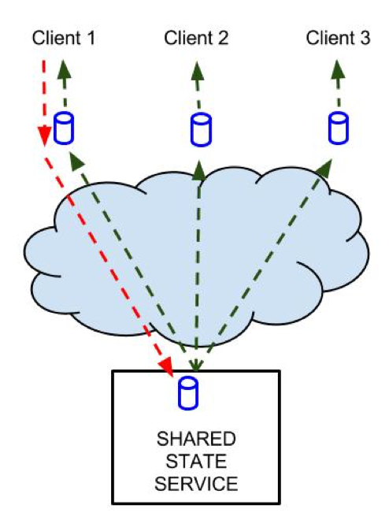

##Shared State


### Navigation
[Introduction][] | [Initialisation][] | [ReadyState][] | [Update][] | [No Update-Reply][] | [Batch Updates][] | [Relative Updates][] | [Update Consistency][] | [Query][] | [Event][] | [Initial State from Event Handler][] | [Shared Data API][] | [Initialisation][] | [Update][] | [Query][] | [Event][] | [Presence][] | [Mapping Service API][] | [Scopes][] | [Initialisation][] | [Event][] | [Request a User/App-Mapping][] | [Request a Group-Mapping][]
###Introduction
Shared state solutions maintain distributed agreement concerning dynamic, online application resources in multi-device applications. Application resources may for instance include application data, context, data, or timing resources. Agreement about current state is maintained continuously, even if the resources are dynamically changing, e.g. updated frequently by connected clients.  Please consult the design document D4.1 for further introduction to the Shared State programming model.

Shared state solutions have two parts; 1) an online service and 2) a local proxy for that service. The proxy provides a local, representation of the current state of the remote service, and programmers may always depend on this representation being updated as soon as possible. 

Shared state solutions defines a high-level programming model, where distributed agents/clients interact with the application and each other - not directly - but indirectly through a common data model. This includes querying and updating shared state, as well as reacting to events as shared state changes. This programming model hides complexities regarding connection management, message-passing, discovery and pairing. Furthermore, the shared state approach encourages clients to communicate directly with servers (reliable) instead of clients (unreliable). 

####Initialisation
```js
var ss = sharedState(url, token, options);
```
The proxy object is instantiated with a string url identifying a particular resource available on a shared state service. A token must be provided so that access privileges may be resolved by the share state service.

####ReadyState

Since the proxy object need to establish a connection with an online server, the proxy will not immediately be ready to use. The property readyState will report the current status of the proxy at all times. In the event that shared state proxies are disconnected from the service, they will automatically try to reconnect, and the readyState will reflect these transitions.
```js
ss.readyState;
ss.on("readystatechange", function (e) {});
```
Event listeners may be bound to the readystatechange event of the proxy. The readystatechange event is fired whenever readyState changes. It should be possible to register event handlers at any time - even before the proxy is connected.

In addition, an initial event is triggered by ss.on(“readystatechange”, handler), for the given handler only. This way the programmer can depend on the handler being called even if the handler was attached after the appropriate readyState (e.g. OPEN) was reached. This pattern is repeated for all shared state events (see further discussion below). 

ReadyStates may be defined as follows.
```js
var _states = Object.freeze({
    CONNECTING : "connecting",
    OPEN : "open",
    CLOSING : "closing",
    CLOSED : "closed",
});
ss.__defineGetter__("STATE", function (){return _states;});
```
We assume this struct to be associated with the *.STATE* property of SharedState instances.
The *.STATE* property should refuse assignment.

Here is some sample code
```js
var ss = SharedState();

// check if open
if (ss.readyState === ss.STATE["OPEN"]) {}

// print readystate
var onreadystatechange = function (state) {
    console.log(state);
    // or
    console.log(this.readyState);
}

// print possible states ()
for (var key in ss.STATE) {
   if (!ss.STATE.hasOwnProperty(key)) continue;
   console.log("key " + key + " value " + ss.STATE[key]);
}
```
 

####Update
```js
var sent = ss.update(param, … ,  options);
```
The update operation requests some kind of change to the shared state, for instance items in a shared collection may be created, modified or removed. The update signature may be slightly different for different instances of shared state. Some API’s may also choose to expose more than one type of update operation, e.g. create and remove primitives. 

**The update operation simply sends a _request_ to the shared state service.**

The result value indicates whether the request was successfully sent or not. In particular, success does NOT indicate that the update has been performed. In contrast, an update operation does NOT take effect until it has been processed by the shared state service. The request may be lost before it reaches the service, or the service may even drop requests upon receipt. The effects of successful updates will be disseminated to all connected agents, including the agent that issued the update. So, after issuing an update request, an agent must expect to wait about 1 RTT before the effects become available locally.
  
The figure illustrates how an agent may issue update-requests (RED), and how the effects are made available to all agents equally, by broadcasting a change-event (GREEN).

####No Update-Reply

The update operation does NOT include a handler for the asynchronous update-reply. In fact, there is no update-reply, only change-events. Programmers accustomed to Ajax-based web programming might find this surprising. They are used to request-reply interaction, the foundation of the Web. However, this is precisely the point of shared state. It is a higher-level abstraction hiding the complexities of lower-level request-reply interaction. In the shared state model there is only updates (actions) and events (reactions). In particular, change-events are handled the same way independent of which agent issued the update. 

####Batch Updates
```js
var sent = ss.request().update(param, … ,  options)
                                    .update(param, …., options)
                                    .update(param, …, options)
                                    .send();
```
In a collaborative application it may be valuable to group multiple update operations into one, and have the shared state service process them all in one batch. This may avoid interleaving with updates from other clients. It would also ensure that unwanted intermediate states never occur.

Share state services use the builder pattern to build a multi-update request, and then to send it. Shared state services must support such a lists of operations in update requests. We recommend that shared state services always work on lists. This way the single update operation above is simply a special case, essentially a shortcut for ss.request().update().send();

####Relative Updates
 
It is possible for shared state services to support update operations that are relative to current state at the server. For instance, the end result after an APPEND operation depends on what the state was before the operation. This is a relative update. Shared state services may support relative updates. For instance, options may be used to indicate if parameters are interpreted as absolute or relative. 

####Update Consistency

We expect shared state services to provide global ordering of all update operations. We also expect this ordering to be preserved through event notifications, so that all clients see the same sequence of state changes. Shared state solutions may offer more sophisticated consistency models, or such models may be built on top of a simpler one.
 

####Query
```js
var result = ss.query(param, … ,  options);
```
Query is a local, inexpensive operation. The local proxy process queries based on it’s current state at any time. Repeated queries will reflect changes in the shared state. Application programmers may for instance choose to update the UI (DOM) based on event-listeners or periodic queries.

####Event

```js
var handler  = function ( e ) {};
ss.on("change", handler, ctx);
ss.off("change", handler);
```
Shared state defines a change event, triggered whenever there is a change to shared state. Application programmers may register and unregister event-listeners using on/off primitives. Different instances of shared state solutions may export more event types. Optional parameter ctx is used as value for this in event callbacks. If not specified, this is the object from which the event was emitted.

Event handlers always expect a single event, corresponding to a single update operation. A batch update will result in multiple invocations of the handler, possibly one for each operation in the batch. 

In shared state event handlers, the keyword this is always the source of the event, i.e. the shared state proxy.

####Initial State from Event Handler

The following is a common pattern when attempting to update UI from shared state:
```js
var current_state = ss.query();
update_ui(current_state);
ss.on("change", function(e) {
    update_ui(e.new_state);
});
```
●	On load the current state is put into the UI.   
●	Next, subscribe to events so that future state changes will be fed to the UI. 

This pattern may become a bit tedious as it is repeated for multiple subsets of the state, and multiple UI elements. Fortunately, we can simplify this for the programmer. We require an initial event to be triggered within ss.on(“change”, handler), specifically for the given handler. This initial event produces the initial state (before any other events). This way, the above code snippet is reduced to:   
```js
ss.on("change", function(e) {
    update_ui(e.new_state);
});
```
Another implication of this trick is that the programmer does not have to worry about attaching the handler too late - i.e. “after the fact”. If the programmer does this the handler will be invoked with the current state. 

For this reason, we require shared state event handlers to deliver an initial event (only to the given handler) before any real events.


 


###Shared Data API

####Initialisation
```js
var ss = mediascape.sharedState(url, options);
```
Initialise with url and an optional options object

Options:  
.reconnection | automatically reconnect, Default = true  
.agentid | agentid used for this connection, Default = random  
.userId | userId used for this connection, don’t supply it if you are using a server based login  
.getOnInit | sync the whole sharedState on start, Default = true  
.autoPresence | sets presence to “online” on start, Default = true  
.autoClean | removes context data from old clients, Default = false  

readyState property and readystatechange event as described above.

####Update
```js
var sent = ss.setItem(key, value,  options);
```

```js
var sent = ss.removeItem(key, options);
```

```js
var sent = ss.request().setItem(..).setItem(..).removeItem(..).send();
```
The dictionary allows multiple update operations to be grouped in one batch.

####Query
```js
var value = ss.getItem(key, options);
```
return value if key exists, else undefined.
```js
var keys = ss.keys();
```
return list of all keys, may be an empty list


####Event

```js
var handler  = function ( e ) {};
ss.on("change", handler, ctx);
ss.off("change", handler);
```
Event Types  
“readystatechange” | whenever readyState is changed - e.g. disconnect  
“change” | whenever a dictionary key is added or changed  
“remove” | whenever a dictionary key is removed  
“presence” | whenever a agent connects or disconnects  

Change Event Properties “readystatechange”  
e is simply the state value


Change Event Properties “change” and “remove”  
.key | string  
.value | value or null  
.type | string, used in “change” events, “add” or “update”  

Change Event Properties “presence”  
.key | agentid as string  
.value | value  


####Presence

If agentid is not supplied, a random one is generated.  This will happen on every reload, so if you want to store it, put it in localstorage or remember it in some other way.
```js
// Option for SharedState:
ss = mediascape.sharedState(url, {"agentid":"someid"});

// Set the state
ss.setPresence(state);

// React to presence changes
ss.on("presence", handler);
```

```js
<html>
<head>
<script type="text/javascript" src="mediascape.js"></script>

<script type="text/javascript">

var sharedstate;

window.onload = function() {
  sharedstate = mediascape.sharedState("http://example.com/")
  .on("readystatechange", function() {
    console.log("READY");
    sharedstate.setItem("aKey","someValue");

  })
  .on("presence", function(e) {
    console.log("Presence: "  + e.key + " changed to " + e.value);
  })
  .on("change", function(e) {
    console.log(e.key + " = " + e.value);
  });
}
</script>
</head>
<body>
</body>
```

###Mapping Service API

The mapping service provides URLs for Shared State channels, and will create these if they are not already present. To provide a flexible solution, applications can request different scopes for such channels in order to simplify both implementation of the services and ensure a flexible and scalable solution.  

####Scopes
Based on login (need userid and appid)  
● Scope **User**  
  ○ All agents of the current user regardless of application  
  ○	Example: All private agents: device state (off, idle, in user by app X)  
●	Scope **UserApp**  
  ○	All agents of the current user for the given application  
  ○	Example: Shared Context  
●	Scope **App**  
  ○	All users of the given application  
  ○	Example: Datapoints for all users of an application, e.g. comments  


Group service:  
●	Scope **Group**  
  ○	All participants of a given group  
  ○	Example: Collaborative viewing, Quiz

####Initialisation
```js
var map = mediascape.mappingService(mappingServiceUrl, options);
```
Initialise with mappingServiceUrl and an optional options object 

Options:  
.maxTimeout | maximum time to wait for a response from the server in ms, Default = 2000  
.userId | userId used for this connection, don’t supply it if you are using a server based login  


####Event
Like for Shared Data, with only “readystatechange” as an event type.

####Request a User/App-Mapping
```js
var mappings = map.getUserMapping(appId, scopeList);
```
returns a Promise including the requested scopes or all available scopes {scope1:”url”, scope2: “url”, ...}

**appId** - id of the current App  
**scopeList** - a list of the requested scopes [“user”, “userApp”, “app”].  
If a url for a scope doesn’t exist it will be created;

####Request a Group-Mapping
```js
var mapping = map.getGroupMapping(groupId);
```
returns a Promise with {groupId:”url”}  
**groupId** - id of the group

```js
<html>
<head>
<script type="text/javascript" src="mediascape.js"></script>

<script type="text/javascript">

var mapping;
var APP_ID = "TheUniqueIDofThisApplication"

window.onload = function() {
  mapping = mediascape.mappingService("http://example.com/")
  .on("readystatechange", function() {
    map.getUserMapping(APP_ID, ["userApp"]).then(function (data) {
       userAppSS = mediascape.sharedState(data.userApp);
       ...
  });
}
</script>
</head>
<body>
</body>
```

[Introduction]: #introduction
[Initialisation]: #initialisation
[ReadyState]: #readystate
[Update]: #update
[No Update-Reply]: #no-update-reply
[Batch Updates]: #batch-updates
[Relative Updates]: #relative-updates
[Update Consistency]: #update-consistency
[Query]: #query
[Event]: #event
[Initial State from Event Handler]: #initial-state-from-event-handler
[Shared Data API]: #shared-data-api
[Initialisation]: #initialisation-1
[Update]: #update-1
[Query]: #query-1
[Event]: #event-1
[Presence]: #presence
[Mapping Service API]: #mapping-service-api
[Scopes]: #scopes
[Initialisation]: #initialisation-2
[Event]: #event-2
[Request a User/App-Mapping]: #request-a-userapp-mapping
[Request a Group-Mapping]: #request-a-group-mapping