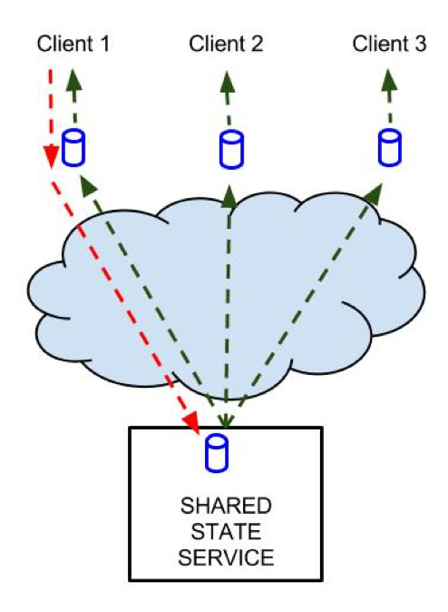

##Application-Context Hello World

This HelloWorld shows the shared state library developed for the [MediaScape project](http://mediascapeproject.eu/) in action.  


## Navigation
[Installation][] | [Prerequisite][] | [Deployment][]  | [Run][]

###Installation
####Prerequisite
* Install git
* Install node.js and npm
* Install mongodb
* Start mongodb

####Deployment
Next to this file you will find a script called `deploy.sh`.  
This script will clone the git and install everything in a folder called `deploy` relative to the file itsself. It will copy the [server](../Server) and the [API](../API) including this HelloWorld sample. After preparing the files, the script will install all needed dependencies for the backend and start a small setup-script to configure it.   
Please dont execute it inside the git folder. Best practice is to download just the the `.sh` file and execute.  

### run
After everything is set up, and the node.js server is started, you can access the demo using the url (depending on your setup): 
```
    http://localhost:8080/index.html
```


When the page is loaded, it should show you can get the URLs for the shared state based on the three scopes on the first tab.
Then you can switch to one of the three scope tabs and connect to the shared state. The HelloWorld offers basic functions in the gui like setItem, removeItem


Any time later you can start the node.js server via:

```bash
node index.js
```

[Installation]: #installation
[Prerequisite]: #prerequisite
[Deployment]: #deployment
[Run]: #run
